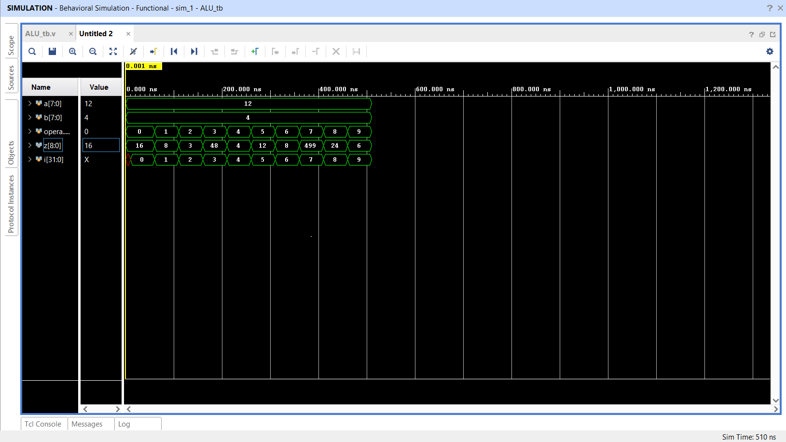

# 8-bit-ALU-Verilog
Verilog-based 8-bit ALU implemented in Xilinx Vivado

A simple 8-bit Arithmetic Logic Unit (ALU) implemented using Verilog HDL. This project was created and simulated in Xilinx Vivado.

## Features
- Performs operations: ADD, SUB, AND, OR, XOR, NOT, SHIFT
- Uses `case` block to select operation
- Tested using a Verilog testbench

## File Structure
- `ALU_8bit.v`: ALU module
- `ALU_tb.v`: Testbench file
- `waveform.png`: Simulation result

## How to Run
1. Open Vivado
2. Create a new project and add `alu.v` and `alu_tb.v`
3. Set `ALU_tb` as top module
4. Run Behavioral Simulation

## Output

## Author
Nayana Mukherjee
